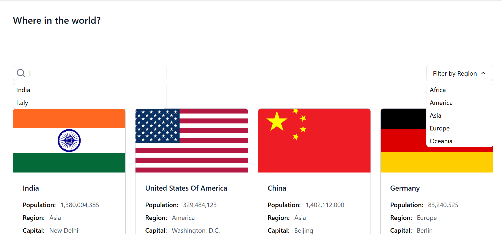
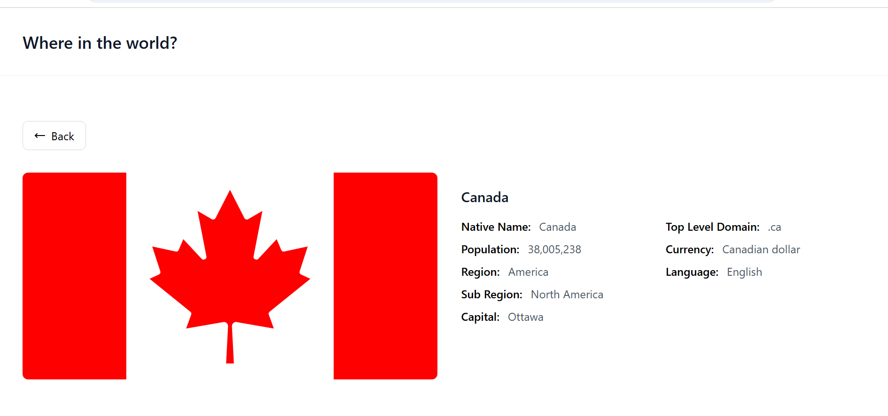

# 🌍 Where in the World?

**Where in the World?** is web application that lets users explore detailed information about countries around the globe. It provides an intuitive interface with search and filtering options, making it easy to discover facts about any country.

---

## ✨ Features
- **Search by country name:** Quickly find countries using an autocomplete search bar implemented with a **Trie data structure** for fast and efficient searching.

- **Filter by region:** Filter countries by region — Africa, America, Asia, Europe, or Oceania.

- **View country details:** Click on any country card to view in-depth information such as:
    - Native name
    - Population
    - Currency
    - Top-level domain
    - And more!

- **Responsive:** Fully responsive UI that looks great on all devices — desktop, tablet, and mobile.

---

## 🛠️ Tech Stack
- **Frontend:** React.js
- **Styling:** Tailwind css
- **Routing:** React Router
- **Data Structure:** Trie (for autocomplete search)

---

## 💻 Getting started
Follow these steps to run the project locally:

```
# Clone the repository
git clone https://github.com/gautam-32b7/where-in-the-world.git

# Navigate to the project directory
cd where-in-the-world

# Install dependencies
npm install

# Start the development server
npm run dev
```

--- 

## 📷 Screenshots
| |  |
|--------------|---------------|