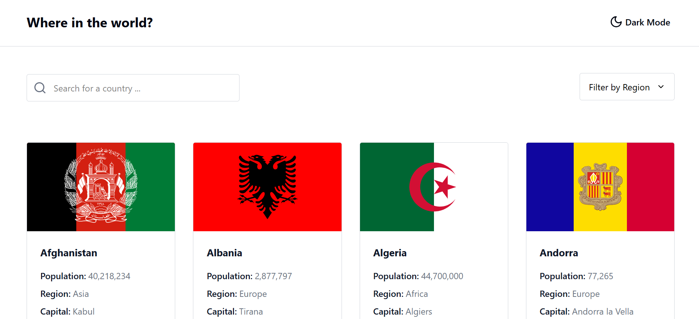
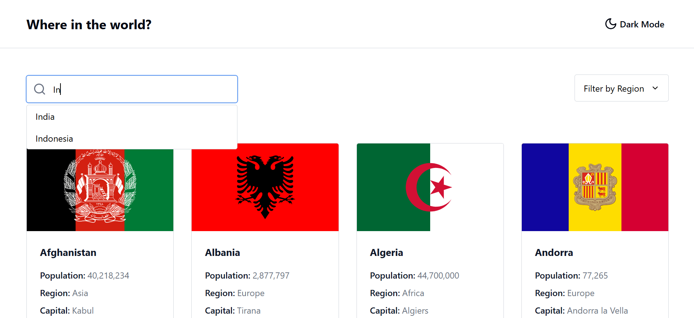
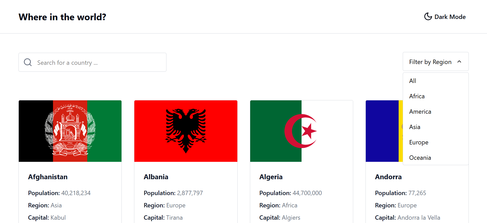

# 🌍 Where in the World

Where in the World is a React.js application styled with Tailwind CSS that lets you explore detailed information about countries around the world.

It features a **Trie-based autocomplete search bar, continent-based filtering** and a **dark mode toggle** for a plesant user experience.

## 📷 Screenshots
<table>
    <tr>
        <td></td>
         <td></td>
          <td></td>
    </tr>
</table>

## ✨ Features
- **Autocomplete Search**: Implemented using the **Trie data structure** for fast and efficient country name suggestions.
- **Filter by Continent**: Easily narrow down countries by selecting a region such as Asia, Europe, Africa, America or Oceania.
- **Dark Mode**: Toggle between light and dark themes for comfortable viewing.
- **Detailed Country Information**: View details such as:
    - Name & native name
    - Capital
    - Region & Subregion
    - Population
    - Currency
    - Languages
    - Bordering countries

## Tech Stack
- **Frontend**: React.js
- **Styling**: Tailwind CSS
- **Data Structure**: Trie for search suggestions.  